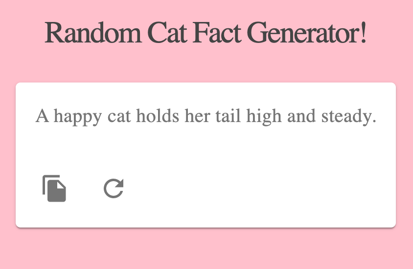

# Random Cat Fact Generator

 
 

This project was bootstrapped with [Create React App](https://github.com/facebook/create-react-app). The original code can be found [here](https://github.com/techomoro/react-random-quote-generator). The random cat facts are from this [project](https://github.com/wh-iterabb-it/meowfacts).

## About

 [Click here to see the Random Cat Fact Generator in action.](https://rainakpuels.github.io/Random-Cat-Fact-Generator)

Using Axios, I was able to fetch external data from the meowfacts API and display it in a React app. On each refresh, a new fact gets displayed. You can also press the refresh button baked into the app, as well as a button that will copy the fact to your cursor! 

## How to Run

In the project directory, you can run:

### `npm start`

Runs the app in the development mode.\
Open [http://localhost:3000](http://localhost:3000) to view it in the browser.

The page will reload if you make edits.\
You will also see any lint errors in the console.

### `npm test`

Launches the test runner in the interactive watch mode.\
See the section about [running tests](https://facebook.github.io/create-react-app/docs/running-tests) for more information.

### `npm run build`

Builds the app for production to the `build` folder.\
It correctly bundles React in production mode and optimizes the build for the best performance.

The build is minified and the filenames include the hashes.\
Your app is ready to be deployed!

See the section about [deployment](https://facebook.github.io/create-react-app/docs/deployment) for more information.

### `npm run eject`

**Note: this is a one-way operation. Once you `eject`, you can’t go back!**

If you aren’t satisfied with the build tool and configuration choices, you can `eject` at any time. This command will remove the single build dependency from your project.

Instead, it will copy all the configuration files and the transitive dependencies (webpack, Babel, ESLint, etc) right into your project so you have full control over them. All of the commands except `eject` will still work, but they will point to the copied scripts so you can tweak them. At this point you’re on your own.

You don’t have to ever use `eject`. The curated feature set is suitable for small and middle deployments, and you shouldn’t feel obligated to use this feature. However we understand that this tool wouldn’t be useful if you couldn’t customize it when you are ready for it.

# Roadmap of Future Improvemenets

No further development is expected.
